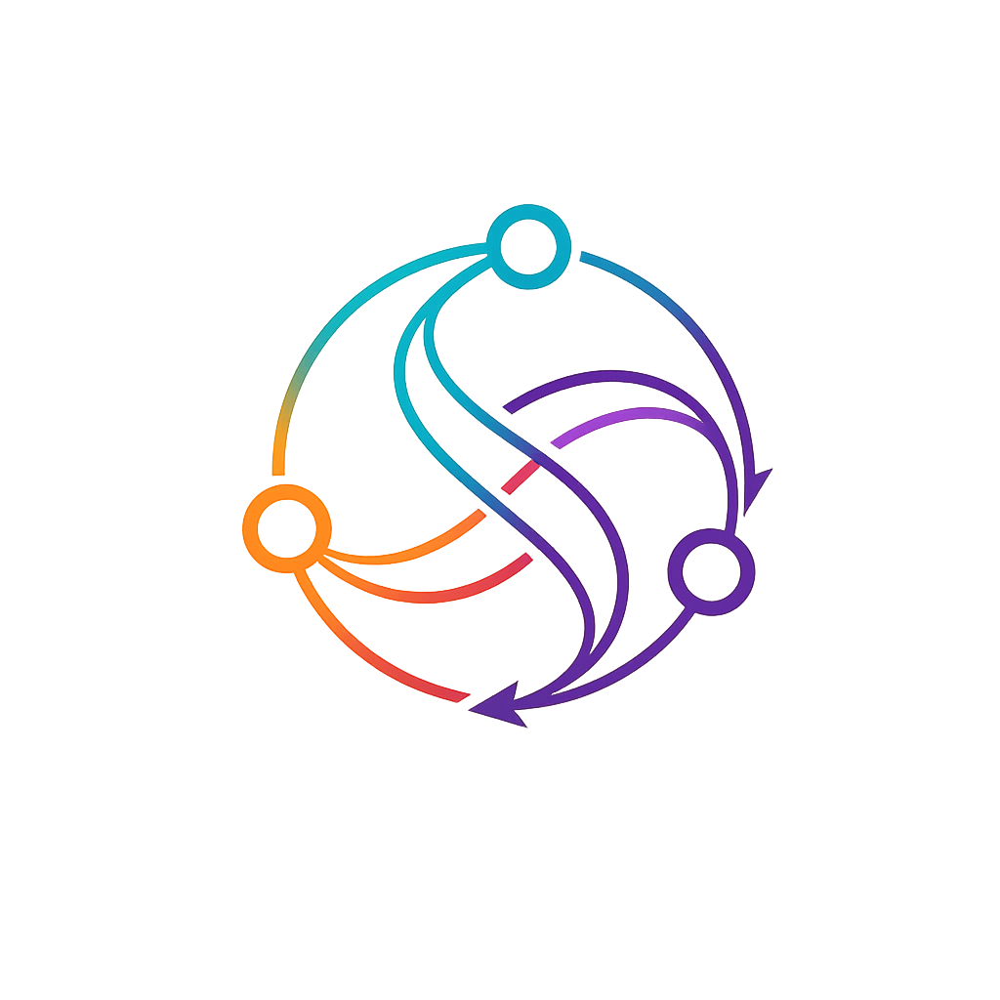
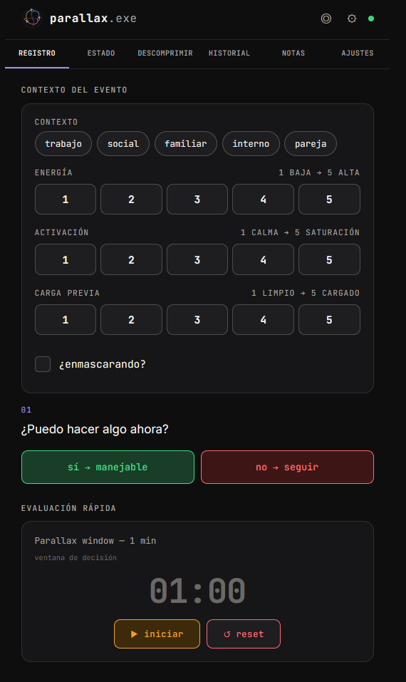
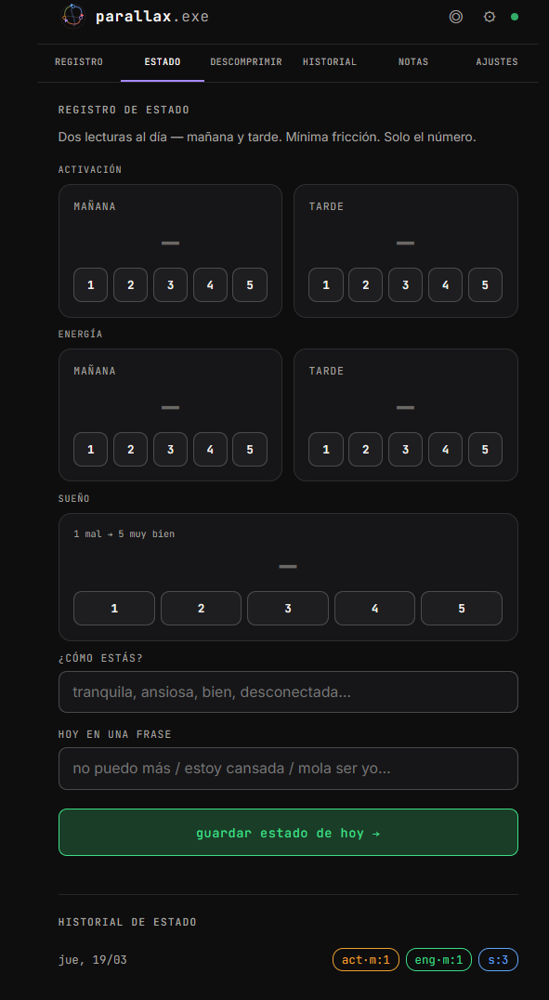
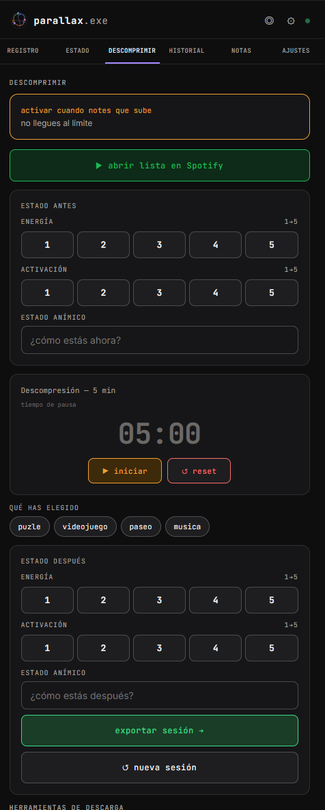
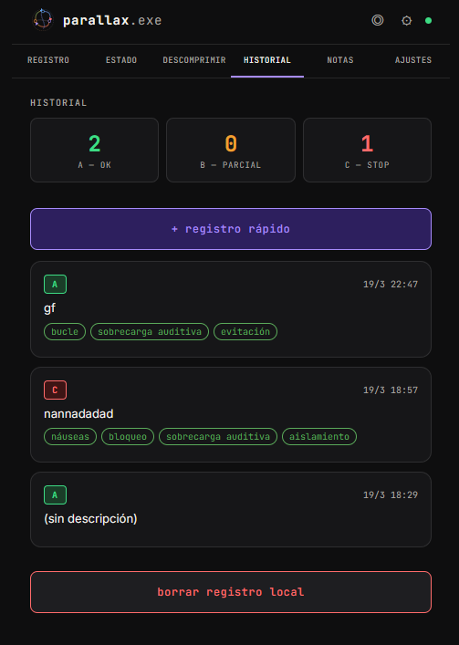
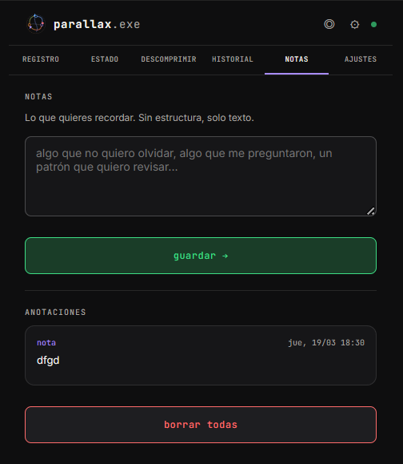
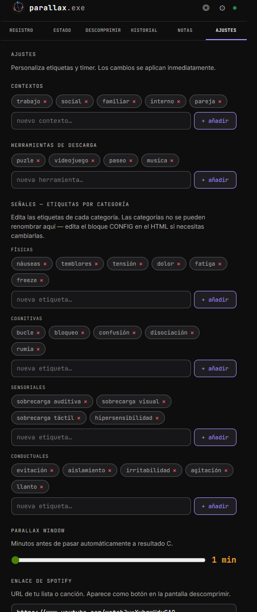

# 



# parallax.exe

*del griego parallaxis — desplazamiento aparente de un objeto observado, debido a un desplazamiento real del observador.*

**Parallax no te dice qué hay. Desplaza el ángulo para que lo veas tú.**

[](https://www.gnu.org/licenses/gpl-3.0)

---

## capturas

| registro                       | estado                     | descomprimir                           |
| ------------------------------ | -------------------------- | -------------------------------------- |
|  |  |  |

| historial                        | notas                    | configuración              |
| -------------------------------- | ------------------------ | -------------------------- |
|  |  |  |

---

## por qué existe

Nació de un colapso y de una hipótesis: que lo que estaba pasando no era desregulación emocional sino sobrecarga de procesamiento sin descarga.

La diferencia importa. Una crisis emocional y un sistema nervioso sin RAM libre se parecen desde fuera. Desde dentro, no tanto.

Cuando empecé a anotar los episodios junto con lo que los rodeaba — energía, síntomas, carga previa, lo que había pasado antes — apareció un patrón. Y cuando el patrón es visible, la intervención útil ya no es en el pico. Es antes.

De esa observación salió una pregunta de ingeniera: ¿puedo modelar esto? Y de esa pregunta, una herramienta.

---

## qué hace

Registra. Clasifica. Sugiere cuándo parar.

No más que eso.

La lógica central es un clasificador de dos preguntas y tres modelos de eventos:

A-> Redondo. Claro y comprensible. Actuable.

B-> Abierto. Con incognitas. Actuable solo parcialmente.

C -> Opaco o incoherente. Solo consumen energía. Suéltalos.

```
¿Puedo hacer algo ahora?
  sí → modelo A. itera.
  no → ¿entiendo cómo funciona esto?
         sí → modelo B. mapea lo que puedas, suelta el resto.
         no → modelo C. para. no modeles. descomprime.
```

Hay una ventana de tiempo — la Parallax window — para intentar resolver antes de que el sistema decida por ti. Si se agota sin resultado, el modelo pasa a C automáticamente.

Lo que no cierra en diez minutos probablemente no cierra en cuarenta.

Pero esto no es el final.

---

## flujo de uso

**En un episodio:**

1. Abres registro. Marcas contexto, energía, activación, carga previa.
2. Respondes las dos preguntas. O dejas que el timer decida.
3. Si es C — paras. El sistema te lo recuerda. Guardas el episodio y vas a descomprimir.
4. Si no es C — guardas el episodio igualmente. El registro en caliente es el dato.
5. Después, en frío, vuelves al archivo y rellenas la revisión: ¿cambiarías la clasificación? ¿qué ves ahora que no veías?

**Cada día:**

Registro basal. Mañana y tarde. Activación, energía, sueño. Una frase si quieres.

La hipótesis es que el estado previo condiciona la gravedad de los episodios. Que activación alta con energía baja es el estado de mayor riesgo — el sistema en alerta sin recursos para gestionarlo.

**Anotaciones:**

Pestaña notas. Lo que no quieres olvidar. Lo que entendiste o lo que quieres pensar mejor. Sin estructura. Solo texto y fecha.

---

## qué puedes esperar

Un mapa de tu propio funcionamiento construido dato a dato.

Correlaciones que no son visibles en el momento pero sí en el historial: qué contextos generan más episodios C, si la carga previa predice la gravedad, si ciertas herramientas de descarga funcionan en ciertas condiciones.

Y la posibilidad de llegar a terapia con información estructurada en lugar de recuerdos fragmentados y activación residual.

---

## qué no puedes esperar

Un diagnóstico. Una interpretación. Una conclusión.

Parallax reporta frecuencias y correlaciones. No decide qué significan. Eso es trabajo tuyo, preferiblemente con acompañamiento profesional.

La herramienta no sustituye ese trabajo. Es el material que llevas.

---

## qué no deberías hacer con los datos

No uses los datos para construir narrativas definitivas sobre ti misma.

El patrón que ves en los primeros veinte episodios no es el patrón completo. Es una instantánea. Útil, pero parcial.

No uses un pico de episodios C como evidencia de deterioro. Ni una semana tranquila como evidencia de que "ya estás bien".

Los datos son observación, no veredicto.

Y si en algún momento el registro se convierte en vigilancia ansiosa de ti misma — si anotar empieza a ser un trabajo más — para. La herramienta existe para reducir carga, no para añadirla.

---

## cómo usarla

**Opción A — directamente en el navegador**

Abre [v0raonline.github.io/parallax](https://v0raonline.github.io/parallax) en cualquier navegador.

En móvil puedes añadirla a la pantalla de inicio y se comporta como una app nativa. En iOS: botón compartir → "Añadir a pantalla de inicio". En Android: menú del navegador → "Añadir a pantalla de inicio".

**Opción B — descarga local**

Descarga `parallax.html` y ábrelo con cualquier navegador. Sin instalación, sin dependencias.

Esta opción te da una copia propia que no cambia si el repositorio se actualiza.

**Nota sobre los datos**

En ambos casos los datos son completamente locales — viven en el `localStorage` de tu dispositivo y nunca salen de él. Si usas las dos opciones en el mismo dispositivo, los datos no se comparten entre ellas: el navegador las trata como orígenes distintos.

---

## cómo funciona por dentro

La app funciona sin conexión. Está diseñada para poder usarla en momentos de activación: mínima fricción, respuestas con un toque.

Todo local. Sin servidor. Sin cuenta. Sin sincronización.

Los datos viven en tu dispositivo. Cada episodio, cada registro basal, cada sesión de descompresión genera un archivo `.md` que guardas en tu carpeta de descargas, manualmente, conscientemente. Ese archivo es la foto de un evento.

Puedes crear un vault de Obsidian para organizarlos mejor.

El paso de moverlo manualmente al vault es parte del proceso — no un workaround técnico. Es el momento de integración: releer en frío lo que registraste en caliente. Aportar más información. Reinterpretar.

---

## estructura de archivos generados

```
parax_YYYYMMDD_HHMM_A.md        → episodio tipo A
parax_YYYYMMDD_HHMM_B.md        → episodio tipo B
parax_YYYYMMDD_HHMM_C.md        → episodio tipo C
parax_basal_YYYY-MM-DD.md       → registro basal diario
parax_flush_YYYYMMDD_HHMM.md    → sesión de descompresión con delta pre/post
parax_consulta_YYYYMMDD_HHMM.md → nota para sesión terapéutica
parax_config.yaml               → configuración exportada
```

---

## personalización

Hazlo tuyo. En la pestaña de configuración puedes modificar:

**Contextos** — las áreas de vida donde ocurren los episodios. Por defecto: trabajo, social, familiar, interno, pareja. Añade o elimina según tu mapa.

**Herramientas de descompresión** — lo que usas para bajar la activación. Por defecto: puzle, videojuego, paseo, música. El nombre es tuyo; la descripción corta también.

**Señales** — las etiquetas de síntomas organizadas en cuatro categorías: físicas, cognitivas, sensoriales, conductuales. Puedes añadir etiquetas dentro de cada categoría. Actualmente los nombres de las categorías se editan directamente en el HTML.

**Parallax window** — la duración del timer del clasificador. De 1 a 30 minutos. Por defecto 10.

**Enlace de Spotify** — una URL de lista o canción. Aparece como botón directo en la pantalla de descompresión. Sin buscar, sin decidir.

Los cambios se aplican inmediatamente y se guardan en el dispositivo. Si restauras la configuración por defecto, vuelve todo al estado inicial — incluidas las etiquetas.

Si necesitas cambiar los nombres de las categorías de señales o el comportamiento central del clasificador, está en el bloque `DEFAULT_CONFIG` al inicio del HTML. Está todo comentado.

---

## análisis de registros con LLM

En `analysis/PROMPT_ANALISIS.md` hay un skill para analizar los archivos exportados por Parallax usando un modelo de lenguaje.

El analizador trata los registros como logs de sistema — igual que se haría con métricas de CPU, memoria o eventos de servidor. Detecta co-ocurrencias, frecuencias y estados críticos. No infiere causas, no interpreta estados internos, no construye narrativas.

**Lo que reporta:** patrones de co-ocurrencia entre variables, frecuencia de tipos de evento, estados de recurso en episodios C, anomalías observables en el historial.

**Lo que no hace:** diagnosticar, interpretar, concluir. Los datos son tuyos. La lectura también.

Uso: copia el contenido del skill como system prompt y pega los archivos `.md` exportados como input.

---

## sobre el proyecto

Desarrollado por [@V0raOnline](https://github.com/V0raOnline).

Repositorio: [github.com/V0raOnline/parallax](https://github.com/V0raOnline/parallax)

---

## licencia

Este proyecto está licenciado bajo [GNU General Public License v3.0](LICENSE).

Puedes usarlo, modificarlo y distribuirlo libremente, siempre que mantengas la misma licencia en cualquier versión derivada.

---

*parallax.exe — uso personal, datos almacenados localmente en el dispositivo.*
*No diagnostica. No interpreta. No decide.*
